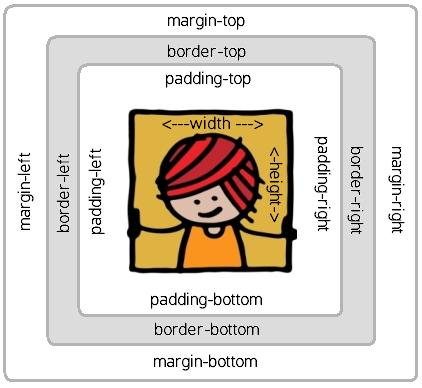

# Cascading Style Sheets

----
# Qué es?

* Un lenguaje para aplicar *estilo* a documentos estructurados con *markup*
* Típicamente usado para HTML...
* ...aunque también sirve para SVG, XUL (y otras variantes de XML)

----
# Porque usarlo?

Es la práctica recomendada para dar estilo por separar contenido de
presentación. Hacer esto:

* Evita duplicación
* Simplifica el mantenimiento
* Permite usar el mismo contenido con diferentes estilos
* Hace que el contenido sea más fácil de procesar por programas

----
# Inserción en HTML

    !html
    <!DOCTYPE html>
    <html>
      <head>
      <meta charset="UTF-8">
      <title>Sample document</title>
      <link rel="stylesheet" href="style1.css">
      </head>
      <body>
        

          <strong>C</strong>ascading
          <strong>S</strong>tyle
          <strong>S</strong>heets
        

      </body>
    </html>

----
# Un ejemplo básico:

    !css
    strong {
        color: red;
    }

* Un archivo CSS contiene reglas, cada una con
    * un selector
    * un conjunto de propiedades con sus valores

----
# Cascadas

* Los estilos se definen en *capas*, con precedencia
    * El estilo default del *user agent*
    * El estilo default del usuario
    * Estilos definidos externamente
    * Estilos del documento
    * Estilos del elemento
* El estilo final puede obtener distintas propiedades de diferentes capas

----
# Herencia

* Algunas propiedades se obtienen de la jerarquía de elementos
    * colores, fonts, ...
* Otras no
    * posicionamiento, tamaño, ...

Ejemplo:

    !css
    strong {
        color: red;
    }
    p {
        color: blue;
        text-decoration: underline;
    }

----
# Selectores

    !css
    strong {...}         /* Elemento */
    .noticia {...}       /* Clase */
    #pie-de-pagina {...} /* id */
    [type='text'] {...}  /* Atributo*/
    div.noticia {...}    /* Combinación de los anteriores */
    a:hover {...}        /* pseudo clases */

    .menu ul {...}       /* jerarquía */
    .menu > ul {...}     /* jerarquía directa */
    h1 + p {...}         /* hermanos adyacentes */
    * {...}              /* selector universal */
    ul, ol, dl { ... }   /* agrupados */

----
# Ejemplo: menú

    !css
    div.menu-bar ul ul {
      display: none;
    }
     
    div.menu-bar li:hover > ul {
      display: block;
    }

Para este HTML:

    !html
    

      <ul>
        <li>
          Archivo
          <ul>
            <li>Abrir</li>
            <li>Guardar</li>
          </ul>
        </li>
        <li>
          Editar
          <ul>
            <li>Copiar</li>
            <li>Pegar</li>
          </ul>
        </li>
      </ul>
    

----
# Colores, fondos:

Hay muchas notaciones de color: `blue`, `#00f`, `#0000ff`,  `rgb(0, 0, 255)`, `rgb(0%, 0%, 100%)`

Se usan en muchos contextos, pero principalmente:

* `color: ...`
* `background-color: ...`

----
# Estilos de texto

* `font` (face, family, size, style, weight)
* `text-decoration`
* `text-shadow`
* `line-height`
* `text-align`

----
# El box model

Cada elemento tiene su “caja” con distintas partes

Los margenes son colapsables: <http://reference.sitepoint.com/css/collapsingmargins>

----
# Especificando dimensiones

* Unidades de medida: `px`, `cm`, `em`, porcentual
* `width`, `height`.
* `margin`, `padding`, `border` (color, estilo)
* `top`, `left`, `right`, `bottom` y regla del reloj
* Valor `auto`
* Márgenes negativos

----
# Posicionamiento

* Flujo: block vs inline
    * Propiedad `display`
* Floats. `float` y `clear`
* `position`: absoluto, relativo, estático, fijo

<http://www.alistapart.com/articles/css-positioning-101/>

