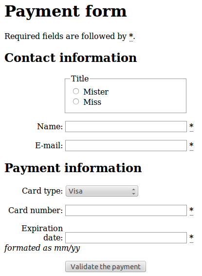

# HTML

----

# Ya saben más o menos que es...

* Un formato estructurado de documentos
* Para la web
* basado en “markup”

----
# Un documento representa:

* Un árbol
* Cada nodo es un *elemento* o *character data*
* Los *elementos* pueden tener subnodos

----
# Cada elemento tiene

* Un elemento tiene un “tipo” (párrafo, imágen, botón, título)
* El tipo determina que contenido es válido:
    * No puede ir cualquier cosa dentro de cualquier cosa
    * No puede ir en cualquier orden
* Un elemento tiene una colección desordenada de “atributos” (pares clave/valor)

----
# Sintácticamente

Si bien un documento HTML **representa** un árbol, **es** un archivo de texto
plano. Los elementos se demarcan con *tags* anidados:

* `
` y `
` marcán un parrafo
* `` denota una foto
* ` ` marca un fin de línea

Además, algunos caracteres se representan con *entidades*:

* `&gt;`, `&lt;` y `&amp;` son las mínimas necesarias

----
#Ejemplo

    !html
    <h2 id="parameters">Parameters</h2>

    
Many API methods take optional parameters. For GET requests, any parameters not
    specified as a segment in the path can be passed as an HTTP query string
    parameter:

    <pre class="terminal">
    $ curl -i "https://api.github.com/repos/mojombo/jekyll/issues?state=closed"
    </pre>

    
In this example, the ‘mojombo’ and ‘jekyll’ values are provided for the <code>:owner</code>
    and <code>:repo</code> parameters in the path while <code>:state</code> is passed in the query
    string.

    <h2 id="client-errors">Client Errors</h2>

    <ol>
        <li>
            
Sending invalid JSON will result in a <code>400 Bad Request</code> response.

        <pre><code> HTTP/1.1 400 Bad Request
     Content-Length: 35

     {"message":"Problems parsing JSON"}
    </code></pre>
      </li>
      <li>
        
Sending the wrong type of JSON values will result in a <code>400 Bad
    Request</code> response.

        <pre><code> HTTP/1.1 400 Bad Request
     Content-Length: 40

     {"message":"Body should be a JSON Hash"}
    </code></pre>
      </li>
      <li>
        
Sending invalid fields will result in a <code>422 Unprocessable Entity</code>
    response.

        <pre><code> HTTP/1.1 422 Unprocessable Entity
     Content-Length: 149

     {
       "message": "Validation Failed",
       "errors": [
         {
           "resource": "Issue",
           "field": "title",
           "code": "missing_field"
         }
       ]
     }
    </code></pre>
      </li>
    </ol>

----
# Detalles de sintáxis

* Muchos estándares, e interpretaciones de errores
* XHTML vs HTML
    * todos los tags se cierran
    * minúsculas, comillas obligatorias
    * validez más estricta
* Doctype

Estándares, variantes, transitional vs strict, bla bla, tl;dr:

    !html
    <!DOCTYPE html>

----
# Detalles de sintáxis

* El whitespace es *colapsado*
    * Se puede indentar!
    * unos pocos elementos son sensibles al whitespace
* Ojo con el escaping, newlines en atributos

Los comentarios tienen una sintaxis peculiar:

    !html
    <!-- comentario -->
    <!>
    <!-- otro       --
      -- comentario -->
    <!------> este también -->

----
# Elementos frecuentemente usados

* Documento: `<html>`, `<head>`, `<body>`
* Encabezado: `<title>`, `<link/>`, `<script>`, `<meta/>`, `<style>`
* Títulos: `<h1>` a `<h6>`
* Contenido: `
`, ` `, ``, `<a>`, `<em>`, `<strong>`, `<code>`, `<pre>`
* Estructura: `
`, ``
* Listas: `<ol>`, `<ul>`, `<dl>`
* Citas: `<q>`, `<blockquote>`

----
# Atributos globales

* `id`
* `class`
* `style`
* `data-*`
* `lang`
* `title`

----
# Forms

* `<form>`
* `<fieldset>`, `<legend>`
* `<input>`, `<textarea>`, `<button>`
*  `<select>`, `<option>`, `<optgroup>`
* Estilo en forms

----
# Ejemplo:

    !html
    <form>
      <h1>Payment form</h1>
      
Required fields are followed by <strong><abbr title="required">*</abbr></strong>.

      <h2>Contact information</h2>

      <fieldset>
        <legend>Title</legend>
        <ul>
          <li>
            <label for="title_1">
              <input type="radio" id="title_1" name="title" value="M." />
              Mister
            </label>
          </li>
          <li>
            <label for="title_2">
              <input type="radio" id="title_2" name="title" value="Ms." />
              Miss
            </label>
          </li>
        </ul>
      </fieldset>
----
# Ejemplo (cont):

    !html
      

        <label for="name">
          Name: 
          <input type="text" id="name" name="username" required />
          <strong><abbr title="required">*</abbr></strong>
        </label>
      

      <h2>Payment information</h2>
       
      

        <label for="card">
          Card type:
          <select id="card" name="usercard">
            <option value="visa">Visa</option>
            <option value="mc">Mastercard</option>
            <option value="amex">American Express</option>
          </select>
        </label>
      

      

        <button>Validate the payment</button>
      

    </form>

----
# Ejemplo (en el browser):

----
# Configuración de un form

* `action`
* `method`
* `enctype`
    * `application/x-www-form-urlencoded`
    * `multipart/form-data`

----
# Variantes de `<input>`

* `type="text"`, y variantes modernas `email`, `number`, `tel`
* `type="password"`
* `type="button"`
* `type="checkbox"`, `type="radio"`, `checked`
* `type="file"`, `accept=`...
* atributo `disabled`
* un caso especial: `hidden`

----
# Performance tips

* Minimización (htmltidy, csstidy, jsmin)
* Separar en dominios, pero no muchos
* Permitir caching del lado del cliente
* Ordenar elementos según necesidad del cliente
* Evitar scripts inline (en especial el “sandwich”)
* Usar “sprites” en vez de imágenes sueltas
* ó CSS moderno en vez de imágenes
* fijar tamaños de imágenes y tablas

