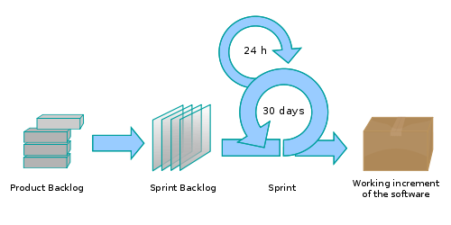
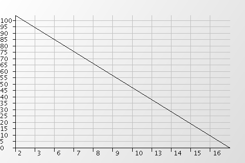
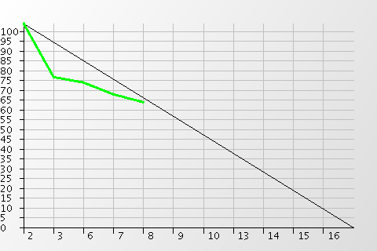
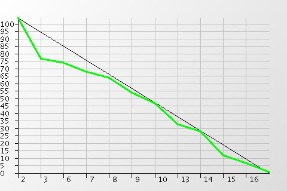

# Gestión de proyectos con Scrum

# Guía de estudio - Parte II

Daniel F. Moisset - <dmoisset@machinalis.com>

© 2011 Machinalis

## El modelo Scrum

Scrum es una metodología para desarrollos de proyectos que encuadra en los
modelos ágiles. El nombre esta directamente tomado del artículo 
*The New New Product Development Game* donde llaman *scrum fields* a los
contextos organizacionales asociados a las prácticas que luego acabarían
llamándose ágiles. 

Aún cuándo el artículo describía productos físicos, las prácticas aplicaba
también para desarrollo de software en contextos de requerimientos cambiantes y 
requisitos de respuesta rápida, contexto que era común en muchos proyectos.

En base a estas prácticas fue que Ken Schwabber a principios de los 1990s
fue construyendo una metodología concreta en su compañía, Advanced Development
Methods. Simultáneamente Jeff Sutherland desarrollo y aplicó en 1993 en Easel
Corporation un conjunto de prácticas similar, y empezó a referirse a ellas
como Scrum. 

Ken Schwabber y Jeff Sutherland unieron esfuerzos y al integrar y pulir su
conjunto de prácticas, las presentaron en 1996 en OOPSLA como un nuevo método
de construcción de software.

Cinco años más tarde, ambos serían dos de los 17 participantes de la reunión
que culmino en el manifiesto ágil, y que definió a Scrum como uno de los
procesos que encuadraban bajo la bandera de los métodos ágil.

Scrum ha sido utilizado con éxito desde los '90s para gestionar el desarrollo
de productos. En algunos aspectos Scrum no es estrictamente un proceso, sino
un esqueleto en base al cual se pueden integrar distintas técnicas de
desarrollo y construcción del producto, y sobre las cual es posible adaptarse
y mejorar. Esto hace que haya distintas estrategias de aplicación de Scrum.

> Cuando no existen reglas
> establecidas, se espera de los
> usuarios de Scrum que
> deduzcan qué hacer. No trate
> de encontrar una solución
> perfecta, porque el problema
> por lo general cambia
> rápidamente. En su lugar,
> pruebe algo y vea cómo
> funciona. Los mecanismos de
> inspección y adaptación de la
> naturaleza empírica de Scrum
> le guiarán
> 
> Ken Schwabber and Jeff Sutherland, The Scrum Guide 2010

### Introducción

Scrum es un método de trabajo fácil de explicar, pero que requiere experiencia
seguir, porque involucra niveles de participación, compromiso, y adaptación
mayores a los necesarios para seguir un plan fijo.

Scrum es un proceso altamente adaptable, no predictivo; esta enfocado más
fuertemente en personas y no procesos, y encuadra también en el modelo de
producción iterativo, donde se construyen incrementos de valor.

Como proceso ágil, el producto se construye en una visión, avanzando en los
aspectos a los que el cliente le da valor. Los avances se hacen en iteraciones
breve que son como pequeños proyectos de desarrollo. En cada una de ellas
se hacen específicos aquellos aspectos que se consideran valiosos y que 
pueden hacerse efectivos en el tiempo de la iteración, y se trabaja en ellos
para producir un incremento funcional y entregable.

Según el producto, puede considerarse una versión “final” del proyecto luego
de que una iteración tiene el valor suficiente, o puede considerarse que un
incremento se utiliza en producción pero el proyecto sigue activo. En algunos
contextos (servicios on-line) esto se puede traducir en actualizaciones
permanentes.

Además del ciclo de las iteraciones (que típicamente dura 7 a 30 días), Scrum
agrega un segundo ciclo dentro de este, de frecuencia diaria, donde se
evalúa avance y se planifica el trabajo para el próximo día.

El modelo típicamente se describe en base a los *roles*, reuniones (en inglés
*events*) y elementos (en inglés *artifacts*); cada uno de ellos cumple
una función específica en el uso de Scrum. El modelo también define un conjunto
de reglas que le da coherencia a los elementos anteriores definiendo como se
relacionan e interactúan.

Todos los roles colaboran en un equipo auto-organizado con margen de decisión
a nivel de la responsabilidad que tiene de llevar adelante el proyecto a través
de un entorno que favorezca la colaboración y que cada uno aporte trabajo en
base a su conocimiento, no según una organización preestablecida.

### Valores

Scrum se define como una práctica “empírica”[1]. El empirismo afirma que 
la información se obtiene a través de la experiencia, y de la toma de decisiones
en base a lo que se conoce. El control de procesos empírico requiere sostener:

**Transparencia** de aspectos significativos del proceso a aquellos responsables
por el resultado. Estos aspectos deben estar delimitados claramente para que
los responsables que toman decisiones puedan interpretar su significado. Por
ejemplo, un lenguaje común para referirse al proceso o una definición de
criterios de calidad compartida entre los que hacen el trabajo y quienes lo
aceptan o rechazan.

**Inspección** frecuente de indicadores medibles para detectar variaciones. Los
distintos elementos de Scrum permiten evaluar el avance hacia una meta y
mantener al día esa evaluación, pero con una cantidad de esfuerzo que no
interfiere con el trabajo

**Adaptación** del proceso o del trabajo para corregir desviaciones detectadas.
Las adaptaciones deben realizarse lo antes posible para minimizar la desviación.

Las reuniones de Scrum son esencialmente puntos de inspección y adaptación. El
ciclo más largo en Scrum es la iteración (usualmente llamada *sprint*) e incluye
uno de estos puntos. En este punto es posible cualquier redefinición del
proyecto, con lo cual la duración del sprint es el tiempo máximo que puede
persistir una desviación (suponiendo que no haya sido detectada antes)

Para que los involucrados puedan evaluar cumplimiento de objetivos, es decir
que haya transparencia, los incrementos producidos en cada sprint deben ser
no abstractos e internos (ej: diseño de base de datos), sino funcionalidad
observable y utilizable. Intentar previsualizar el resultado final y construir
en capas es contraproducente en la premisa de estabilidad y debe evitarse el
trabajo en fases.

[1] Ken Schwabber and Jeff Sutherland, The Scrum Guide 2011

Respecto al funcionamiento del equipo, es importante que este siga los siguientes
valores:

 * **Empowerment** al equipo para que pueda organizarse y tomar decisiones
 * **Respeto y confianza** en los conocimientos y capacidades de los miembros
   del equipo entre sí
 * **Responsabilidad y auto-disciplina** (por decisión propia, no impuesta
   externamente).

### Roles

Scrum define un “Equipo”, donde hay algunos roles funcionales diferentes. El
equipo esta compuesto por aquellas personas que están *comprometidas*, y
mantiene afuera a aquellas que sólo están *implicadas*. El equipo es:

 * Auto-organizado: nadie de afuera el equipo le dicta como realizar su trabajo.
 * Multi-disciplinario: todo el trabajo a realizar puede ser alcanzado por los
   miembros del equipo.

El **Propietario del Producto** (o *Product Owner* en inglés) es el encargado
de maximizar el valor del producto para el trabajo realizado. Hay distintas
formas de hacer esto acorde a la organización. Independiente de ello, el
propietario de producto es la única persona responsable de gestionar la
*Pila de producto*, tarea que incluye:

 * Conocimiento de la visión, el entorno de negocio, los objetivos y sus
   prioridades
 * Comunicación clara de visión, metas y requerimientos al equipo
 * Clasificar los requerimientos según su valor
 * Garantizar que el trabajo realizado tenga valor
 * Tener las atribuciones necesarias para tomar las decisiones
 * Garantizar de que la pila de producto sea clara y que este al alcance de
   todos
 * Garantizar que el equipo de desarrollo tenga clara la pila de producto
 
En carácter de responsable, puede delegar cualquiera de los aspectos anteriores
al equipo, pero es el que responde por ellos. Es ideal (aunque no muy 
frecuentemente posible) si el propietario de proyecto ya trabajó dentro del
mismo equipo.

El propietario del producto es siempre una persona, no un grupo que toma
decisiones. En muchos casos esta persona en realidad representa un grupo, pero
si este grupo desea modificar la pila de producto debe convencer primero al
propietario de producto. Para que esto tenga sentido, debe ser una persona 
que tenga el respeto y apoyo de la organización, haciendo su trabajo 
transparente (se refleja en la pila de producto). Nadie más puede establecer
las prioridades del equipo de desarrollo, y el equipo no debe tomar tareas
de nadie más.

El **equipo de desarrollo** es un grupo de profesionales multifuncional con
las capacidades para crear el incremento. Cada uno de los miembros del equipo
es denominado **desarrollador**, sin importar sus habilidades específicas

El equipo se organiza y se gestiona para poder producir efectivamente. Nadie,
ni siquiera el Scrum Master, le dice al equipo como convertir items de la
pila de producto en incrementos.
 
Los miembros del equipo pueden tener foco en áreas diferentes del desarrollo,
pero son todos igualmente responsables por el productor realizado. Las reglas
de Scrum no permiten que se construyan sub-equipos dedicados a dominios
específicos como análisis o testing.

El tamaño del equipo debería ser lo suficientemente chico como para permitir
que haya comunicación, y lo suficientemente grande para que se pueda realizar
trabajo significativo en cada iteración. Tamaños típicos de equipo son 3 a 10
personas.

Además del trabajo de desarrollo, en sí, el equipo tiene las siguientes
responsabilidades:

 * Conocer y entender la visión del propietario del producto
 * Colaborar con desarrollar la pila del producto.
 * Participar, cada miembro, en las decisiones donde pueda aportar valor.
 * Respetar los valores colaborativos de Scrum

El **Scrum Master** es la persona encargada de que el resto comprenda y siga
la organización y reglas de Scrum. Es una persona que sirve al resto del equipo
como facilitador, y como evaluador de que las prácticas que se siguen sean
beneficiosas (i.e. generen valor).

El Scrum Master presta múltiples servicios en ese sentido tanto al propietario
de producto como al equipo de desarrollo, siempre con el propósito de mejorar
el trabajo de los demás. El Scrum Master no es un líder del equipo, simplemente
lo separa de las distracciones.

Algunas tares que el Scrum Master puede realizar es:

 * Asesorar al resto de los miembros del equipo
 * Revisar la pila de producto
 * Moderar y coordinar las reuniones, y otras interacciones entre miembros
   del equipo.
 * Resolver impedimentos durante el Sprint
 * Prestar atención al proceso para poder aplicar mejoras

### Ciclos

Imagen © Lakeworks, ver licencia en http://en.wikipedia.org/wiki/File:Scrum_process.svg

El ciclo principal del Scrum es el *Sprint*, un período de tiempo prefijado 
(*timebox*, es decir su duración solo depende del tiempo calendario) de un mes
o menos donde se crea un incremento del producto “Completo”, usable, y
potencialmente entregable. Durante un mismo proyecto, todos los sprints tienen
la misma duración. Cada sprint comienza apenas termina el anterior.

Un sprint consta de una *Reunión de Planificación de Sprint*, los
*Scrums Diarios*, el trabajo de desarrollo en sí, la *Revisión de Sprint* y 
la *Retrospectiva de Sprint*

A lo largo del sprint no se permiten demasiados cambios:

 * No se modifica la duración del Sprint
 * No se modifica la meta del Sprint
 * No se modifica al equipo de desarrollo y metas de calidad
 * El alcance puede aclararse y renegociarse entre el propietario de producto y
 el equipo de desarrollo a medida que se obtiene más información
 
Cada sprint puede verse como un proyecto de corto plazo. En este plazo se
define que se va a construir, se planea como se trabajará y será el producto
resultante.

El scrum diario es un ciclo de 24 horas de duración dentro del sprint. El
propósito de este ciclo es que el equipo de desarrollo sincronice su estado y
planifique actividades para las siguientes 24 horas.

### Las reuniones

Cada sprint comienza con una **reunión de planificación** donde se define el
trabajo que se realizará en el sprint entre todos los miembros del equipo. 
Pueden también asistir otras personas que el equipo considere pertinente por
tener información u opiniones valiosas para el objetivo de la reunión.

Esta reunión dura típicamente entre 4 y 8 horas (usualmente proporcional a la
longitud del sprint).

El objetivo de la reunión es decidir cuales requerimientos serán desarrollados
durante el sprint, y que trabajo se realizará para lograr el objetivo. Para
decidir esto se utilizar la pila de producto (donde están todos los
requerimientos organizados según su valor) el último incremento del producto
obtenido, la capacidad proyectada del equipo de desarrollo, y el rendimiento
histórico del equipo de desarrollo. 

Al iniciar la reunión, el propietario del producto presenta los items más
prioritarios de la pila de producto al equipo de desarrollo, y entre todo el
equipo se colabora para comprender estos items. En base a esto y la
información disponible, se hace una primera aproximación de cuales items
de la pila de producto serán efectivamente realizados durante este sprint. 
Solamente el equipo de desarrollo tiene la libertad de decidir cuantos y cuales
items de la cola de producto se compromete a realizar para el siguiente
sprint.

Una vez que esto se selecciona, la reunión entra en una segunda fase donde
el equipo decide como construirá transformarán estos items en un incremento
“completo” a lo largo del sprint. Aquellos items que se seleccionan para el
Sprint más el plan para llevarlos a cabo se denomina *pila del Sprint*. Los
items se descomponen en tareas, todas de un día o menos de trabajo, y se
estima el esfuerzo necesario para realizar a cabo estas tareas. El propietario
de producto puede participar clarificando aspectos que sean necesarios en
esta etapa.

Con esta información es posible determinar si el volumen de trabajo es
realmente compatible con la capacidad del equipo, y de no ser así se puede
discutir con el propietario de producto (para ajustar los requerimientos de
items en discusión, o para añadir/quitar items al Sprint)

Para el final de la reunión, el equipo de desarrollo deberá tener definido una
cola de producto con un conjunto de funcionalidad a entregar, separado en tareas
estimadas, que sea compatible con la capacidad disponible.

Para que la reunión sea efectiva es importante que:

 * La organización disponga los recursos necesarios para realizar el sprint.
 * El propietario de producto tiene lista la pila de producto priorizada y
   actualizada, con suficientes items para trabajar en el sprint.
 * El equipo tenga un conocimiento de la tecnología y del negocio suficiente
   como para poder descomponer los items en tareas y estimar el esfuerzo
   que involucra cada una de estas tareas.

El Scrum Master debe garantizar:

1. Que se realice esta reunión al inicio del sprint
2. Que el propietario del producto haya preparado la pila de producto
3. Que el diálogo sea entre el equipo y el propietario de producto, y que otros
participantes aporten pero no tomen decisiones ni acoten el diálogo
4. Que el equipo comprenda visión y necesidades de negocio del cliente.
5. Que la reunión efectivamente produzca una pila de sprint, y que todos
tengan claro la duración del sprint y la fecha de la revisión
6. Que el equipo no demore excesivamente en aspectos de arquitectura que deberían
pertenecer al sprint.

Una vez planificado el Sprint, la reunión que se repetirá día a día es la
**reunión diaria de Scrum**.

Esta reunión tiene un límite duro de tiempo de 15 minutos, y su propósito es
revisar el trabajo realizado y planificar el trabajo a realizar en el siguiente
Scrum diario. La reunión debe realizarse todos los días a la misma hora y en el
mismo lugar para reducir complejidad. Sólo el equipo de desarrollo y el Scrum
Master participan. Otros asistentes pueden observar pero no hablar. 

La reunión inicia con cada miembro del equipo explicando:

1. Qué logró desde la reunión anterior?
2. Qué logrará hasta la próxima reunión?
3. Qué obstáculos le impiden avanzar?

También se actualiza la cola de sprint con información de las tareas completadas
o el esfuerzo faltante en aquellas parcialmente completadas.

Luego se discuten los ajustes y acciones que hagan falta para que se pueda
lograr lo comprometido, y para eliminar los obstáculos.

El Scrum Master es el encargado de que la reunión se lleve a cabo, y de que 
se cumpla el time-box de 15 minutos. También de que terceros no interrumpan
al equipo de desarrollo. La reunión diaria no es para informar avance a
terceros, sino para que la gente que efectivamente está realizando el trabajo 
se organice.

Esta reunión es un punto clave de inspección y adaptación, y una forma de
mejorar la comunicación y distribuir el conocimiento general sobre el
proyecto.

Una vez finalizado el sprint se realiza una reunión de **revisión del sprint**
donde el equipo de desarrollo presenta el incremento al propietario de producto
y posiblemente a otros involucrados. El propósito es obtener información de
retorno y ajustar la pila de Producto si es necesario.

Esta es una reunión informal que dura típicamente de 2 a 4 horas. Informal
quiere decir que no es una demo orquestada, ni debería estar basada en una
presentación de slides. Lo que se muestra debe estar basado en el incremento.
La reunión es informativa, no para toma de decisiones o crítica del incremento.

Durante la revisión deben cumplirse los siguientes objetivos:

 * El propietario de producto identifica que requerimientos están “completos”
   y cuales no.
 * El equipo de desarrollo demuestra aquello que está “completo” y responde
   preguntas sobre el Incremento.
 * El grupo entero discute sobre lo que viene en base al estado de ese momento
   de la pila de producto, con lo cual se produce información de entrada a la
   siguiente planificación
   
El resultado más concreto de la revisión es una pila de producto revisada y
actualizada;  otro resultado menos concreto pero tanto o más importante es el
acuerdo entre los involucrados de lo que el Incremento cumple o no.

Típicamente luego de la revisión se hace una **retrospectiva**. A veces estas
dos reuniones se solapan o se confunden entre sí; dado que ambas son puntos
de inspección y adaptación entre sprints. La diferencia es el objeto que se
analiza en cada una; mientras que la revisión se enfoca en el
incremento(producto), la retrospectiva se centra en el equipo (personas y
procesos).

En esta reunión participa el equipo de desarrollo, y dura típicamente 45 a 90
minutos.

El objetivo de la retrospectiva es identificar:

 * Aspectos que funcionar notablemente bien en el sprint, problemas encontrados
   y cuan satisfactorias fueron sus soluciones.
 * Necesidades a cubrir respecto a procesos, personas y herramientas.
 * Identificación de acciones que eliminen obstáculos, y que promuevan
   interacciones beneficiosas.

El Scrum Master tiene el rol de promover al equipo a que mejore, y a adaptar
sus prácticas para hacer el proceso más efectivo y personalmente satisfactorio
para el siguiente Sprint. Es usual también ajustar en esta etapa la definición
de “Completo” para incorporar nuevos aspectos de calidad.

Para el final de la retrospectiva el equipo debería haber identificado líneas
de acción para mejora del equipo. Si bien las mejoras pueden implementarse en
cualquier punto, la retrospectiva brinda un evento enfocado en inspeccionar
y adaptar el proceso.

### Los elementos

Los elementos (a falta de una buena traducción hispana de *artifact*) de Scrum
son aquellos objetos tangibles que se producen durante el desarrollo.

El elemento más obvio es el **incremento**, que como ya se mencionó es el
resultado principal del Sprint. Este es el único elemento que tiene valor
de negocio intrínseco. Todos los demás elementos son auxiliares para enfocar
al equipo en su construcción del incremento.

El incremento solo incluye partes “completas” del producto. No incluye
prototipos, o componentes que no han sido probados o integrados.
Es importante para cada proyecto acordar una definición de “completo” en el
equipo que incluya todos los aspectos de calidad transversales al proyecto.
Por ejemplo, si el sistema requiere algún tipo de documentación o proceso
de validación, esto debería estar incluido en esta definición. Es normal
que esta definición incluya “directamente utilizable por el usuario” y
probada (cualquiera sea el proceso de QA que se utiliza).

En algunos proyectos se da que en el primer sprint no se produce un incremento,
sino intangibles (diseño, infraestructura), sobre todo si se trabaja con
tecnologías que requieren mucho andamiaje para tener un producto inicial.
Esto es posible (siempre y cuando sea planificado), aunque las tecnologías
ideales para aplicar métodos ágiles son aquellas que permiten tener una
versión inicial funcional (aún si la funcionalidad es mínima o trivial)
con poco esfuerzo.

La **pila de producto** es una colección de requerimientos. Scrum no define
que información contiene o como se registra, pero si la necesidad de que
refleje, tanto al inicio del proyecto como en el día a día, aquellos
requerimientos que están alineados con la visión del producto. La pila de 
producto puede modificarse permanentemente, y el propietario de producto es el
encargado de mantenerla la día. No existe tal cosa como una versión “final” de
la cola de producto.

Los requerimientos no los desarrolla un equipo separado especializado en 
requisitos, sino que los propone le propietario de producto (tal vez a partir
de su interacción con el equipo u otros involucrados), y el equipo colabora en
refinarlos. El propietario de producto no sólo tiene la decisión final de lo
que va en la cola de producto, sino también de cuales son las prioridades
de estos items.

En resumen, la pila de producto es un refinamiento de la visión, separado en
items definidos y priorizados.

Cada uno de estos items puede ser cualquier cambio al incremento: agregar o
quitar funcionalidad, mejorar performance, mejorar costo de producción, 
corregir errores, etc.

Antes del inicio del proyecto, debe haber una pila de producto, con trabajo
suficiente para al menos un sprint.

La **pila del sprint** es un plan de trabajo para el sprint actual. Contiene
los requerimientos que quedan cumplir para alcanzar la meta del sprint actual, 
y detalle adicional de las tareas involucradas para que el incremento cumpla
con estos requerimientos. Es principalmente una herramienta de comunicación
interna del equipo de desarrollo

La división en tareas debería ser granular, en tareas de no más de 2 días
hombre de trabajo. Tareas más grandes deben descomponerse en trozos menores.
Para cada tarea además se debe incluir información adicional indicando
quien(es) están trabajando en cada tarea, y cuanto esfuerzo se estima necesario
para finalizarla. De este modo se puede medir el avance a diario e identificar
rápidamente riesgos y problemas.

Al principio del sprint el contenido en requerimientos se negocia con el
propietario del proyecto. Luego, sólo el equipo puede separarlo en tareas,
estimar estas tareas, y actualizarlo a lo largo del sprint.

Scrum tampoco define una forma particular para este elemento, aunque cualquier
formato que se elija (físico o digital) debe cumplir lo siguiente:

 * Poder ser modificable conjuntamente por todo el equipo, de forma directa.
 * Esta visible a todo el equipo, en un lugar prominente.
 * No contiene demasiada información irrelevante, sino que permite observar
 el estado del sprint de un vistazo.
 
Hay equipos que implementan esto con un pizarrón en el lugar de trabajo, una
hoja de cálculo compartida, o alguna herramienta específica para gestión
de proyectos Scrum. E responsabilidad del Scrum Master encontrar el medio que
se adapte mejor a las circunstancias del equipo.

La pila del sprint se mantiene al día por lo menos a diario, durante la
reunión diaria. En esa reunión también se mantiene un elemento que es en
realidad otra vista sobre la pila del Sprint que es el **gráfico burn-down**.

Este gráfico tiene como propósito poder visualizar de forma simple el avance
del equipo durante el sprint. Debería estar en un lugar visible para el equipo
y mantenerse a la vista durante las reuniones diarias. 

El gráfico es un gráfico de línea con dos ejes. En el eje horizontal, están
los días del sprint, en el eje vertical, el esfuerzo que falta para completar
el sprint. Al comenzar el sprint se comienza un nuevo gráfico, con el eje
de tiempo ajustado a la longitud del sprint, y el eje de esfuerzo ajustado a la
suma de las estimaciones de las tareas. Se traza además una línea *de base* que
representa el caso ideal donde se realiza todo el trabajo a ritmo constante.
Esta línea recta va desde el punto superior izquierdo (al iniciar falta realizar
todo el trabajo) hasta el inferior derecho (al terminar está todo el trabajo
realizado)

A lo largo del sprint se actualizará este gráfico con una segunda curva en
base a las mediciones actualizadas diariamente. Se comienza con un punto también
en el extremo superior izquierdo, y luego después de cada reunión diaria, se
calcula el esfuerzo restante y se ubica ese punto en ese día, conectando días
consecutivos

La lectura del gráfico se hace bastante intuitiva. Uno tiene la referencia
ideal, y cuando la curva real esta por debajo de la ideal el sprint está
adelantado, y si está por arriba, el sprint está atrasado. Al finalizar el
sprint, la curva cubre todo el gráfico y alcanza la esquina inferior derecha
si el trabajo fue completado:

La **definición de “Completo”** (*definition of Done* en inglés) es un documento
vivo en el cual se acuerda entre todo el equipo los estándares de calidad y
procesos propios del equipo. Esto es importante para que haya un acuerdo de lo
que significa cuando un miembro del equipo indica que un item de la cola o 
un incremento están “completos”. 

Si bien esta definición puede alterarse en cualquier momento, la retrospectiva
suele ser un momento ideal para hacerlo. Además hacerlo a mitad de un sprint
puede significar una modificación al trabajo para hacer, con lo cual muchas
veces se toma nota de la modificación pero se hace efectiva al sprint
siguiente.

Idealmente, esta definición establece reglas bien claras de si algo está o no
completo.
