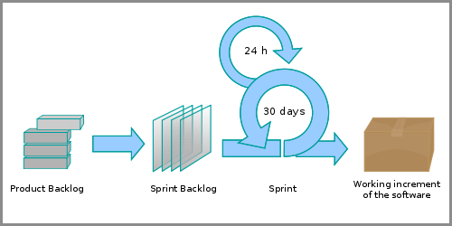

# Gestión de proyectos con Scrum

----

## Daniel F. Moisset

## dmoisset@machinalis.com

© 2011 Machinalis

----

# El modelo Scrum

----

## Historia

 * Basado en The New New Product Development Game
 * Diseñado en un contexto de Software (aunque no específico a éste)
 * Desarrollado independientemente por Schwabber+Sutherland
 * Presentado conjuntamente en 1996
 * Usado con éxito durante dos décadas

----
## Flexibilidad

 * Da un marco general, pero deja muchos detalles operativos a criterio del
   equipo.
 * “Lo mejor es enemigo de lo bueno”:
    * No tratar de encontrar la mejor solución, sin una buena, y verificar
      empíricamente

----
## Scrum es fácil de explicar

 * Pocos elementos
 * Pocos roles
 * Pocas reglas 
 * Lo que falta se define al practicarlo
 
----

## Scrum es complejo de seguir

 * Conocimiento tácito
 * Requisitos de participación y compromiso
 * Creatividad y adaptación

----
## Scrum es ágil

 * Adaptable, no predictivo
 * Iterativo
 * Construye incrementos funcionales
 * En base a una visión

----
## El modelo

Imagen © Lakeworks, ver licencia en <http://en.wikipedia.org/wiki/File:Scrum_process.svg>

----
## El modelo

 * Roles
 * Ciclos
 * Reuniones (o *events*)
 * Elementos (o *artifacts*)
 * Reglas

----
## Valores

Control de procesos empírico:

 * Transparencia
 * Inspección
 * Adaptación
 
Del equipo:

 * Empowerment
 * Respeto y confianza
 * Responsabilidad y autodisciplina 
 
----
## Roles

 * Chanchos y gallinas

Los chanchos, o *El Equipo*:

 * Propietario del Producto
 * Equipo de desarrollo
    * Desarrolladores
 * Scrum Master

----
## El propietario del producto

El encargado de maximizar el valor. Gestiona la *pila de producto*:

 * Conoce visión, objetivos, prioridades, requerimiento
     * Las comunica al equipo
     * Clasifica por valor
     * Garantiza claridad en la comunicación
     * Puede tomar decisiones respecto a valor y requerimientos
 * Verifica que el trabajo tenga valor

----

## El equipo de desarrollo

 * Auto organizado
 * Multi-funcional
 * Todos igualmente responsables
    * No hay responsables de área

Es necesario que todos en el equipo

 * Conozcan la visión
 * Colaboren con la pila de producto
 * Participen en las actividades donde pueden aportar valor
 * Respeten los valores de Scrum

----
## El Scrum Master

 * NO es un gestor de proyecto
 * NO indica a los demas como realizar su trabajo
 * Se encarga que se este siguiendo Scrum
 * Se encarga de que el proceso sea el mejor
 * Elimina obstáculos

----
## Tareas de Scrum Master

Solo a modo de ejemplo:

 * Asesorar al resto de los miembros con sus tareas sobre Scrum
 * Coordinar y moderar las reuniones
 * Verificar que se mantenga la pila de producto
 * Tomar nota de mejoras posibles en las interacciones y procesos
 
----
## Ciclos

 * El *Sprint*
 * El *Scrum* diario

----
## El sprint

 * Longitud decidida previamente (7-30 días)
 * Longitud consistente en un proyecto
 * Consecutivos

Contiene:
 * Planificación
 * Un *Scrum Diario* por cada día laborable
 * Revisión
 * Retrospectiva

----
## Cambios durante el sprint

 * No se modifica la duración
 * No se modifica la meta
 * No se modifica al equipo y las metas de calidad
 * El alcance puede aclararse y renegociarse a medida que aparece más
   información

----
## El scrum diario

 * 24 horas
 * Define un periodo máximo para sincronización y replanificación
 * Garantiza mantenimiento al día de información de retorno
 * Es donde el trabajo efectivo se realiza.
 
----
## Las reuniones

 * Planificación
 * Reunión de *Scrum Diario*
 * Revisión
 * Retrospectiva
 
----
## Planificación

 * Participa todo el equipo
    * Se pueden invitar involucrados
 * Al inicio del sprint
 * 4 a 8 horas, en 2 partes
 * Objetivo: generar un *cola de Sprint*
    * Cuales requerimientos se van a cumplir
    * Cómo
 
----
## Planificación: Input

 * La *pila de producto* actualizada
    * Y con contenido suficiente
 * El último incremento
 * Capacidad proyectada del equipo
 * Rendimiento histórico del equipo

----
## Planificación: Desarrollo

Primera parte: selección de alcance

 1. El propietario presenta los items más prioritarios de la pila de producto
 2. Se colabora para comprenderlos
 3. Se hace una estimación gruesa de cuales pueden ser hechos en el sprint.

Sólo el equipo de desarrollo puede decidir si un conjunto de items entra o no
en el sprint.
 
----
## Planificación: Desarrollo (2)

Segunda parte: planificación y estimación

Para cada item en la fase anterior:

 1. El equipo de desarrollo lo separa en tareas
 2. El propietario del producto provee feedback
 3. El equipo estima el esfuerzo para realizar las tareas
 4. Se registra en la cola del Sprint
 
Luego se recalcula el esfuerzo y se renegocia el alcance si no es
coherente con la capacidad del equipo.

----
## Planificación: Output

*Cola del Sprint* inicial:

 * Conjunto de requerimientos
    * Divididos en tareas pequeñas
    * Estimados
 * Coherencia entre este conjunto y la capacidad del equipo

----
## Planificación: Rol del SM

 * Asegurarse que la reunión se haga al inicio del sprint
 * Verificar que el propietario haya preparado la cola de producto
 * Enfocar el diálogo entre equipo de desarrollo y propietario, evitando interrupciones
 * Ayudar a comprensión mutua de visión y necesidades de negocio
 * Asegurarse que la reunión produzca output
 * Dejar clara la duración y fecha de la revisión
 * Evitar que la reunión se extienda en aspectos técnicos.
 
----
## Reunión diaria

En alguna bibliografía, también se le dice *stand-up meeting*

 * Participa el equipo de desarrollo
    * Pueden asistir otros, pero NO hablar
 * A diario durante el sprint. Misma hora y lugar
 * Limitada a 15 minutos
 * Objetivo: sincronizar y planificar tareas, identificar obstáculos

----
## Reunión diaria: Desarrollo

 * Cada miembro del equipo explica:
     1. Que logró desde la última reunión
     2. Que planea lograr hasta la próxima
     3. Que obstáculos le impiden avanzar?
 * Se coordinan acciones para cumplir metas y lograr obstáculos.
 * Se actualiza la *cola del sprint* y el gráfico de *burn-down*.
 
----
## Revisión del sprint

 * Participa el equipo entero
    * Pueden asistir otros, pero NO guíar la reunión
 * Al final del sprint
 * De 2 a 4 horas
 * Objetivo: presentar incremento del proyecto y obtener información de retorno

----
## Revisión del sprint: Desarrollo

 * Es informal
 * La guía el equipo de desarrollo
 * El propietario y otros involucrados comentan sin interrumpir
 * Se muestra el incremento. No diagramas, documentos, o slides
 * Se actualiza la cola de producto

----
## Revisión del sprint: Output

 * Identificación por parte del Propietario del producto de cuales requerimientos están completos y cuales no
 * Respuestas del equipo de desarrollo sobre el Incremento a los involucrados
 * Identificación de cambios futuros y actualización de pila del producto
 
----
## Retrospectiva

 * Participa el equipo
 * Al final del sprint
 * De 45 a 90 minutos
 * Objetivo: detectar mejoras del proceso y ajustarlo

----
## Retrospectiva: Desarrollo

 * En modalidad abierta se discute:
    * Qué aspectos funcionaron bien y se deberían repetir
    * Qué problemas se encontraron y si sus soluciones fueron satisfactorias
    * Qué se debería modificar o añadir al proceso
 * Luego se determinan acciones para realizar

El Scrum Master tiene un rol central en coordinar el proceso, y asegurar que
luego se lleve a cabo.

----
## Retrospectiva: Output

 * Lineas de accion para mejora del equipo
    * Acciones concretas, con responsabilidad asignada
 * Modificaciones a la definición de “Completo”

----
## Elementos

 * El incremento
 * La Pila de Producto
 * La Pila del Sprint
 * El gráfico de burn-down
 * la definición de “completo”

----
## El incremento

 * Tiene valor por si mismo
 * Solo partes “completas”

A veces es posible que la primera iteración no prodzca incrementos

----
## La pila de producto

 * Colección de requerimientos
 * Administrada y ordenada por el propietario del producto
    * Refinada por el equipo de desarrollo
 * Formato no estandarizado
    * Debe tener items independientes
 * Actualización permanente (crítico al momento de inicio de sprint)

Es una versión organizada en requerimientos de la visión

----
## La pila del sprint

 * Colección de requerimientos para el sprint
    * negociada entre el equipo de desarrollo y el propietario
    * dividida en tareas pequeñas, estimadas (por el equipo de desarrollo)
    * siempre decreciente
 * Formato no estandarizado
    * Debe ser visible y modificable
    * En un lugar prominente
    * Sólo información esencial 
 * Actualizada a diario por el equipo de desarrollo

----
## El gráfico de burn-down

Trabajo restante vs tiempo:

 * Actualizado a diario
 * A la vista

----
## El gráfico de burn-down

 * Refleja información de la cola de Sprint
 * Tiene una linea de base

----
## El gráfico de burn-down

 * Permite comprobar y reajustar a diario el trabajo estimado

----
## La definición de “Completo”

 * Escrito entre todo el equipo
    * Equipo de desarrollo y product owner.
 * Actualizado en base a aprendizaje
 * Estándares de calidad
 * Útil como medida para inspección durante la revisión y como guía del trabajo

