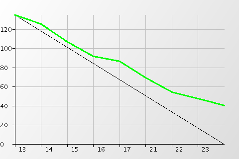

# Gestión de proyectos con Scrum

----

## Daniel F. Moisset

## dmoisset@machinalis.com

© 2011 Machinalis

----

# Scrum: consejos desde la trinchera

----

# Requerimientos ágiles

----

## Requerimientos

 * Scrum no dice como son los items de la pila...
 * ... pero tienen que ser de alguna forma

Por ejemplo:

 * Casos de Uso
 * Tarjetas kanban
 * Historias de usuario

----
## Requerimientos: idealmente

 * Independientes
 * Negociables
 * Valiosos
 * Estimable
 * Pequeño (*Small*)
 * Testeable

----
## Requerimientos: cómo deben ser

En Scrum, cada item:

 * Debe poder expresar aspectos funcionales y no funcionales
 * Debe poder escribirse muy rápido, pero también crecer en detalle si hace falta
 * No debe ser costoso de generar ni de modificar
 
----
## Una opción: historias de usuario

 * Simples, en lenguaje natural e informal, entendibles por el cliente
    * Pueden ser escritas por el cliente
 * Breves
 * Usualmente para requerimientos funcionales
 * No son un documento cerrado, sino un generador de conversación
 
----
## HUs: estructura usual

Como *rol de usuario* quiero/puedo *meta/deseo* para que *beneficio*

El último aspecto es opcional.

> «Como usuario que cierra la aplicación, quiero que se me pregunte si deseo
> guardar si hice algún cambio desde la última vez que guardé, para poder
> conservar trabajo útil y poder descartar trabajo erróneo.»

----
## HUs: como transformar en trabajo

Las historias de usuario suelen requerir discusión para delimitar mejor

 * Definir límites precisos
 * Revisar interacción con otras historias

Usualmente se les adjuntan documentos adicionales:

 * Escenarios
 * Acceptance tests
 * Maquetas
 
----
## HUs: en Scrum 

 * El PP recolecta las historias en la pila de sprint
 * El PP pone detalle en las mas prioritarias
 * El ED va estimando, y pidiendo detalle si hace falta

Al llegar al planning

 * El ED toma lo recolectado y habla para definir mejor el alcance 
 * Las decisiones tomadas suelen quedar en el plan de tareas

----

# Estimación ágil 
 
----
## Estimación

Scrum habla de “esfuerzo”:

 * Horas? días?
 * Otra cosa?

Es importante:

 * No ser perfeccionista
 * Si ser adaptivo
 * Valorar el conocimiento (juicio de expertos)
 * Descomponer en tareas pequeñas

----
## Estimación: Unidad 

 * Distinción entre trabajo realizado y esfuerzo
    * Trabajo: tiempo ideal y real
    * Esfuerzo: puntos de esfuerzo
 * El esfuerzo realizado por unidad de trabajo varía a lo largo del proyecto
 * El esfuerzo para una misma tarea se puede considerar constante
 
Relación entre esfuerzo y trabajo: *velocidad*

----
## Puntos de esfuerzo: ejemplos

1 punto de esfuerzo: 1 coffee break

 * Leer los emails a la mañana
 * Reinstalar el SO y software de trabajo en mi computadora
 * Hacer un asado
 * Contratar a un gerente de marketing
 * Tomar una ducha

----
## Poker de planificación

 * Evita “anchoring”
 * Usa escalas exponenciales para reflejar incerteza
 * Es independiente de la unidad de esfuerzo
 * Pequeñas variantes, todas con la misma idea

----
## Poker de planificación: ejemplo

1 cabra = 1 punto; 1 caballo = 20 puntos

 * Un lobo?
 * Una vaca?
 * Un canguro?
 * Una oveja?
 * Un gorila?
 * Una persona?
 * Un cerdo?
 * 100 conejos?
 * Un triceratops?
 
----
## Poker de planificación: ejemplo

1 cabra = 27kg; 1 caballo = 520 kg

 * Un lobo: 36kg = 1.3p
 * Una vaca: 465kg = 17p
 * Un canguro: 35 kg = 1.3p
 * Una oveja: 55kg = 2p
 * Un gorila: 207kg = 7.7p
 * Una persona: 62kg = 2.3p
 * Un cerdo:  192kg = 7.1p
 * 100 conejos: 250kg = 9.3p
 * Un triceratops: 9400kg = 350p

----
## Retroalimentando

Al finalizar el sprint se conoce:

 * El trabajo realizado
 * Los puntos de esfuerzo estimados que se completaron
 * Una buena aproximación del trabajo a realizar en el sprint siguiente 
 
Con esto se puede estimar la velocidad y puntos de esfuerzo que se
avanzaran en el siguiente sprint.

----
## Retroalimentando

 * Distintas formas de considerar la información pasada
 * Se esta ajustando por dos cosas:
    * la efectividad del trabajo.
    * la precisión de las estimaciones

Se simplifica ajustar las estimaciones (no hace falta)

----

# Desarrollo Ágil

----
# Prácticas de desarrollo ágil

Scrum es probablemente la forma más conocida de *gestión ágil*

XP es la forma ágil más conocida de *desarrollo ágil*

* Pair programming
* Test Driven development
* Continuous integration
* Refactoring

----

# “Booteando Scrum”

----
## Empezar es difícil

 * ¿A quién pongo en cada rol?
 * ¿Qué metodologías uso en cada espacio abierto?
 * ¿Qué unidad uso para estimar?
    * ¿Cuánto es un punto de esfuerzo? ¿Qué velocidad tiene el equipo?
 * ¿Cómo se si hago las cosas bien?

----
## Asignando roles

 * Separarlos evita conflictos de intereses
 * Separar brinda más foco

El Scrum Master:

 * Es bueno empezar con un SM dedicado
 * No se puede superponer SM con Propietario
 * Después se puede cambiar!
    * En algunas organizaciones lo rotan
 
----
## Asignando roles

El Propietario de producto:

 * Si no es del cliente, tiene que tener buen diálogo con el cliente
 * No tiene que ser técnico, pero ayuda a que plantee requerimientos más
   razonables.
 * No debería tener miedo de pedir ayuda
 * superponerlo con un desarrollador es posible, pero complejo
 
Es el rol más crítico y difícil de cambiar al arrancar. 

----
## Tomando decisiones

 * Conviene empezar con lo que uno sabe hacer
 * Hay espacio para mejorar evolutivamente

Algunas cosas que hacemos y funcionan van a funcionar peor:

> Mientras se preste atención, no importa 

----
## El proceso de estimación

 * Cualquier baseline bien comprendido sirve como unidad
 * Si hay alguna tarea que todos saben hacer, se le puede asignar un punto
 * Sino se puede dar una relación con horas (reales o ideales)
    * Que *va a cambiar*

----
## Evaluando

El primer sprint, sobre todo la primera vez, suele ser un poco caótico:

    
Pero tampoco tanto, y se ajusta.

----

# Respuesta a cambios

----
## Respuesta a cambios

(cuando son durante un sprint)

 * De equipo
 * De requerimientos
 * De tareas

----
## Cancelando un sprint

 * La decisión final es del propietario de producto
    * Posiblemente por influencia de otros (chanchos o gallinas)
 * Sucede cuando la meta del sprint deja de tener sentido
    * Es muy inusual
 * Las cosas completas pueden parar a un incremento
 * Las incompletas vuelven al backlog
    
----

# Buenas prácticas

----
## Grooming

Agregar detalle y estimaciones a la pila de producto

 * Requiere trabajo del equipo de desarrollo
 * En colaboración con el PO
    * Pero se puede hacer por iniciativa del equipo de desarrollo
 * El Equipo debe designar algún método para hcer grooming
    * No debería ser más del 10% de la capacidad

----
## Durante el planning

 * El PO debería explicar cambios significativos en la pila de producto
    * Y sus causas
 * Puede ayudar definir un lema del sprint
 * Mantener foco en preguntas que afectan el estimate
 * Confiar en los expertos
 * Que todos puedan opinar no significa que sea necesario.
 * Evitar discusiones largas para items pequeños
 
----
# Durante el sprint

 * Priorizar tareas por riesgo, obstáculos, dependencias
 * El scrum diario me garantiza un punto de ajuste
    * Pero si se puede resolver un problema antes, mejor
 * Intentar resolver los problemas con los involucrados

----
# En el Scrum diario

 * Prestar atención a los demás
 * Buscar si se puede ayudar
 * Fijar reuniones para cosas que requieran más discusión
 * Dejar para cada impedimento alguna acción que ayude en eso, y un responsable
   (típicamente el SM). Usar un *blockage board*
 * Ajustar horarios que le queden lo más cómodo posible al equipo
 * *rápida* y *energética*
 * No es un «informe al jefe»
 * Marcar con claridad inicio y fin

----
# En el scrum Diario

 * Ser específico en el trabajo a hacer
    * Y concreto con el volumen de trabajo
 * Prepararse de antemano
 * Notificar de las ausencias
    * de ser posible mandar el reporte
 * Evitar las discusiones técnicas, y cuentos
 * Ponerse de pie
 
<http://martinfowler.com/articles/itsNotJustStandingUp.html>

----
# Al medir velocidad

 * Medir esfuerzo restante da mas información que medir trabajo realizado
 * Como se consideran regresiones
    * Ponerlas estimadas da una falsa sensación de velocidad
    * Contarlas por 0 ajusta la velocidad, pero oculta trabajo

----
# Todo el tiempo: YAGNI

 * Postergar el trabajo hasta que se sepa que es *necesario*.
    * Se ahorra tiempo evitando producir cosas que uno no necesita
    * Se evita introducir información “adivinada”
    

